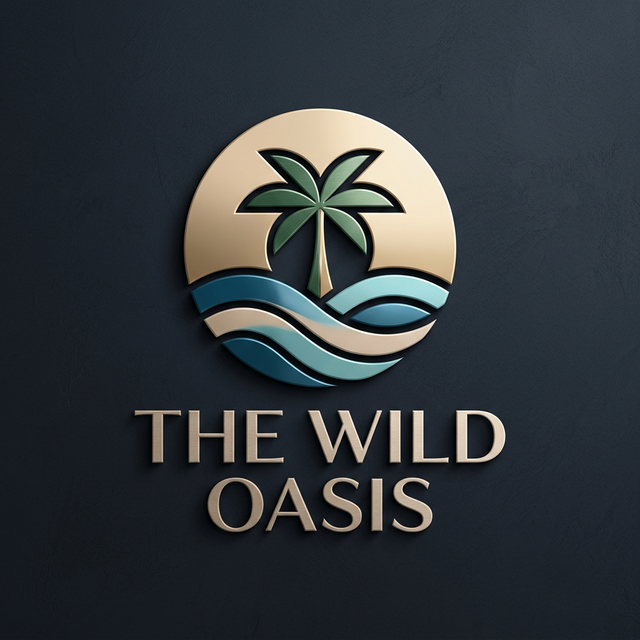

# 🌴 The Wild Oasis: Premium Hotel Management System



### Efficient. Elegant. Effortless.

[🚀 **Visit Live Demo**](https://the-wild-oasis-ghozal.netlify.app/)

**The Wild Oasis** is a comprehensive internal management application designed for a luxury boutique hotel. This purpose-built solution streamlines daily operations, from guest check-ins and cabin management to real-time analytics and revenue tracking.

---

## ✨ Key Features

- 📊 **Intuitive Dashboard**: Real-time insights into bookings, sales, check-ins, and hotel performance.
- 🏘️ **Cabin Management**: Seamlessly manage cabin details, pricing, discounts, and availability.
- 📅 **Booking Lifecycle**: Full control over guest bookings, from creation to checkout.
- 🛎️ **Check-in/Check-out Flow**: Simplified guest arrivals and departures with built-in breakfast options.
- 👤 **User Administration**: Secure employee registration and profile management.
- ⚙️ **System Configuration**: Easily adjust hotel settings, stay durations, and pricing.
- 🌓 **Dynamic Dark Mode**: A sleek, accessible interface that adapts to any environment.

---

## 🛠️ Tech Stack

### Frontend

- **React (Vite)**: High-performance, modern development environment.
- **Styled Components**: Modular, maintainable CSS-in-JS.
- **React Query**: Advanced data fetching, caching, and state synchronization.
- **React Router**: client-side routing.
- **Recharts**: Data visualization and interactive charts.
- **React Hook Form**: Efficient, validation-ready forms.

### Backend & Infrastructure

- **Supabase**: PostgreSQL database, secure authentication, and cloud storage.
- **React Toastify**: Smooth, non-intrusive notifications.
- **Date-fns**: Precision date and time manipulation.

---

## 🚀 Getting Started

To run the project locally, follow these steps:

### 1. Prerequisites

- [Node.js](https://nodejs.org/) installed on your machine.
- A [Supabase](https://supabase.com/) account and a project set up.

### 2. Installation

Clone the repository and install the dependencies:

```bash
git clone https://github.com/your-username/the-wild-oasis.git
cd the-wild-oasis
npm install
```

### 3. Launch the Application

Start the development server:

```bash
npm run dev
```

---
